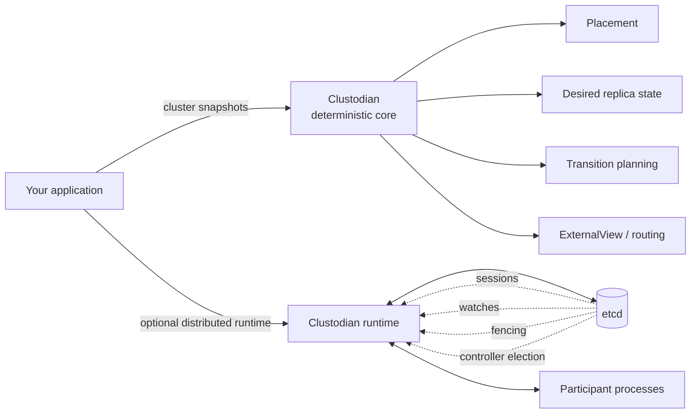
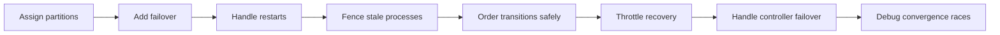
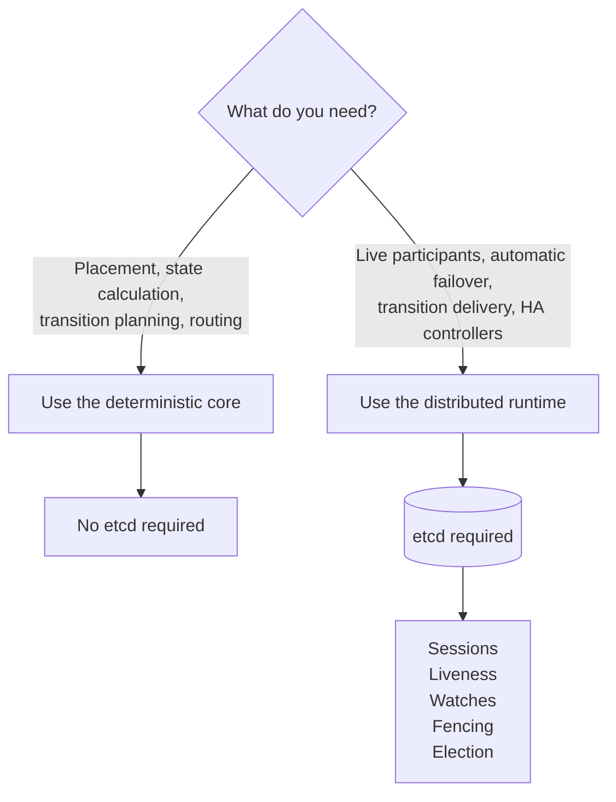
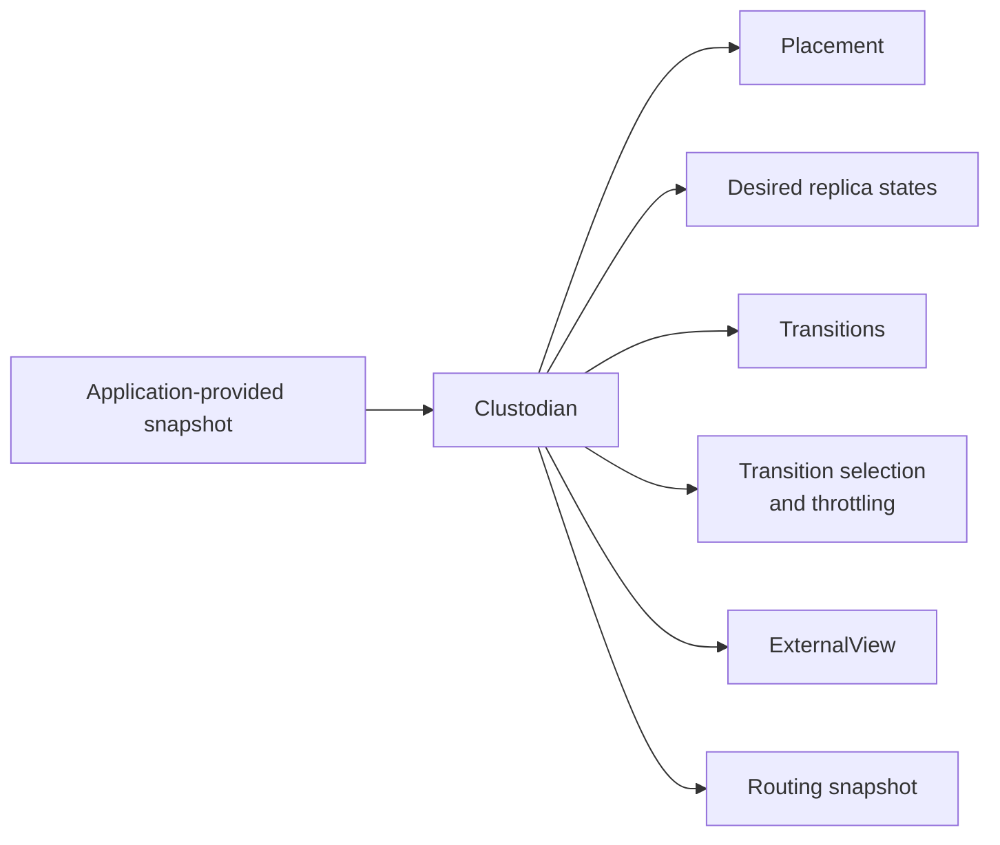
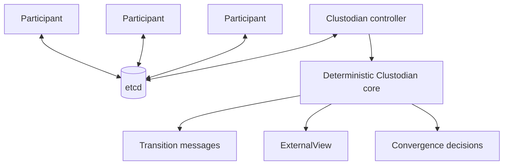
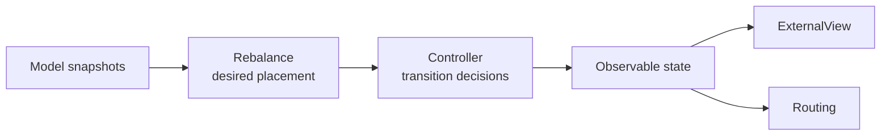
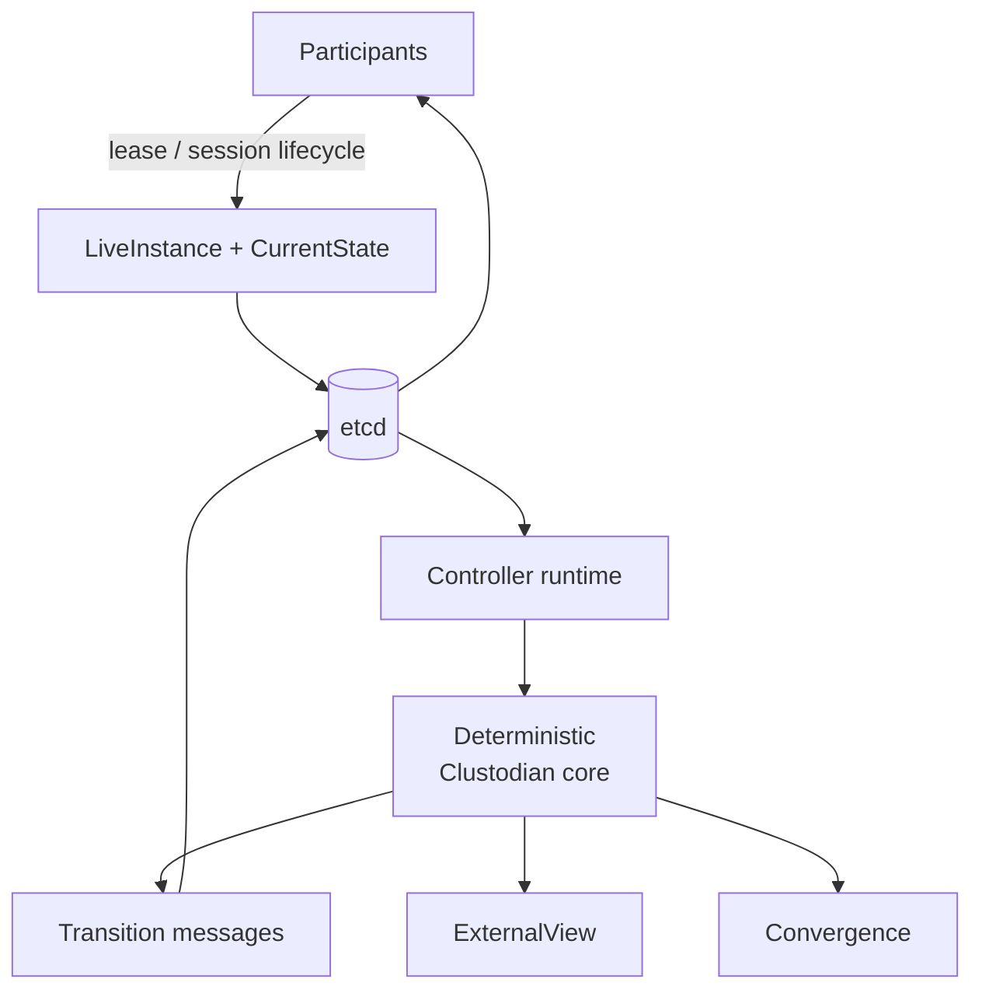
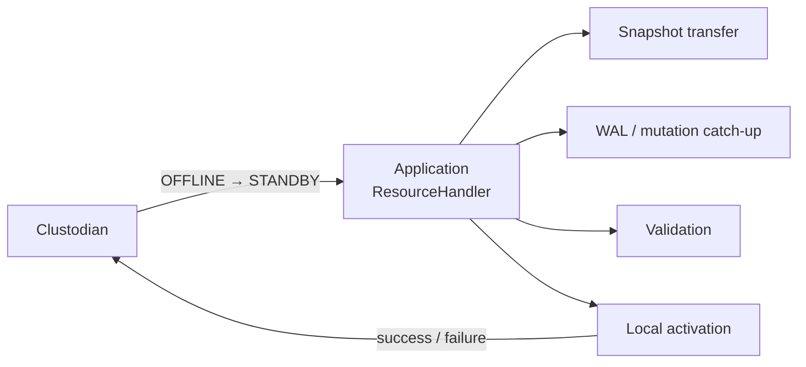

# clustodian

`clustodian` is a Rust control-plane library for partitioned, replicated systems.

It handles the reusable control-plane problems that distributed databases, search engines, queues, caches, object stores, and similar systems repeatedly need to solve:

- partition and replica placement;
- leader/follower or active/standby state assignment;
- state-transition planning and throttling;
- participant liveness and session identity;
- reaction to node join, leave, failure, and recovery;
- cluster convergence;
- observable routing state.

Clustodian decides **what control-plane state should exist and what transitions should occur**.

Your application decides **how its data and services realize those transitions**.

You can use Clustodian in two ways:

1. as a **deterministic Rust library**, with no etcd or background runtime;
2. as a **distributed controller/participant runtime**, using etcd for coordination.

Clustodian’s control-plane semantics are derived from and verified against a deliberately selected subset of [Apache Helix](https://helix.apache.org/) 2.0.1.

Helix was originally developed at **LinkedIn** to solve the same class of problems Clustodian targets: rather than repeatedly building bespoke logic for partition placement, replica state, failover, rebalancing, and recovery inside each distributed system, LinkedIn developed a shared cluster-management model and used it across production distributed infrastructure.

Clustodian takes that battle-tested model and makes the selected semantics available as a **Rust-native, library-first control plane**. The goal is to reuse the hard-won control-plane ideas without requiring the Helix platform itself.

Clustodian is **not** a full Apache Helix port. It does not require Java or ZooKeeper, and it does not aim for Java API, ZNRecord, storage, or wire compatibility.



> **Only the distributed runtime requires etcd.**  
> The deterministic core can be embedded directly with no external service.

---


## Getting Started

**New to Clustodian?**

Follow the [Getting Started guide](GETTING_STARTED.md) to run the replicated KV demo and build your first controller and participant. 

**Only the distributed runtime requires etcd.** 

The deterministic core can be embedded directly with no external service

------


## When would you use Clustodian?

Use Clustodian when a distributed application needs a control plane to decide which nodes should host which partitions, who owns them, and how the cluster recovers when membership changes. Typical workloads include:

- replicated or sharded databases and key-value stores that need replica placement, leader/standby assignment, and automatic failover;
- search clusters and distributed caches that need partition placement and visible rebalancing as nodes are added or removed;
- object-storage coordinators and multi-zone services that need replicas spread across failure domains;
- job or work queues where each partition needs exactly one active worker and ownership must move after a worker failure;
- WebSocket/chat services and game servers where rooms, worlds, or matches must have one active owner and a standby that can take over;
- rolling deployments of stateful services where old sessions and delayed messages must be rejected through incarnation fencing; and
- high-availability control planes where a replacement controller must take over safely and stale controllers must not continue writing.

These applications commonly need some combination of membership, placement, ownership, replication, failover, and restart/incarnation fencing. Clustodian provides those coordination decisions and runtime protocols; it is not the database, cache, search engine, object store, queue, or application data plane itself.


## Why not implement this yourself?

A basic cluster controller can look easy to build: track membership, assign partitions, elect a leader, and move ownership when a node fails.

The difficult part is keeping that controller **safe and convergent under failure**. Real systems eventually have to handle stale processes, restarts, partially completed transitions, controller failover, transition ordering, throttled recovery, rebalancing, and the distinction between desired state and the state participants have actually reached.

Those problems tend to accumulate gradually in homegrown control planes:



If your problem is only a lease or simple leader election, Clustodian may be unnecessary. But once you have partitioned resources, replicas, state transitions, failover, rebalancing, and process restarts, using an explicit and independently verified control-plane model is safer than inventing those semantics from scratch.


## Do I need etcd?

**Not necessarily.**

The deterministic Clustodian core is ordinary Rust library code. It has no networking, persistence, etcd, ZooKeeper, or background runtime.

You need etcd when you want Clustodian to operate as a distributed runtime.



| What you want to do | Need etcd? |
|---|:---:|
| Compute replica placement | No |
| Compute desired replica states | No |
| Plan or select state transitions | No |
| Apply transition throttling | No |
| Build an `ExternalView` from supplied state | No |
| Build a routing snapshot from supplied state | No |
| Embed Clustodian inside your own control plane | No |
| Track live participant processes | **Yes** |
| Manage participant sessions and restart identity | **Yes** |
| Deliver transitions to participant runtimes | **Yes** |
| Automatically react to joins, failures, and restarts | **Yes** |
| Run a controller event loop with watches | **Yes** |
| Run HA controllers with leader election | **Yes** |
| Use the complete Clustodian runtime | **Yes** |

### Without etcd

Your application supplies cluster state explicitly.



Typical inputs include:

- resources, partitions, and replicas;
- state-model definitions;
- current replica state;
- live-instance information.

This mode is useful when:

- you only need Clustodian's placement or state-machine algorithms;
- your application already owns its own runtime or durable coordination;
- you want deterministic computation with no external service;
- you want to drive Clustodian directly from tests or another control plane.

### With etcd

The runtime manages live participant and controller processes.



etcd supplies the distributed coordination primitives needed for:

- participant leases and liveness;
- session identity;
- metadata persistence;
- watches and revision tracking;
- transactional fencing;
- transition-message queues;
- controller election and failover.

Clustodian uses those primitives to implement Helix-style runtime semantics.

**etcd is therefore a runtime backend, not a dependency of the deterministic controller core.**

---


## Installation

Add the published crate to your `Cargo.toml`:

```toml
[dependencies]
clustodian = "0.1.0"
```


## How it works

Suppose a replicated partition should live on three nodes:

```text
P42 -> [node-a, node-b, node-c]
```

and its current state is:

```text
node-a  LEADER
node-b  STANDBY
node-c  OFFLINE
```

Clustodian may determine that the next safe transition is:

```text
node-c  OFFLINE -> STANDBY
```

Clustodian does **not** make the replica usable itself.

Your application might implement that transition by copying and preparing the actual replica:


Those storage and data-plane operations belong to the application.

The boundary is:

> **Clustodian decides what control-plane state should exist and what transitions should occur. The application decides how application data and services realize those transitions.**

---


## Using Clustodian

Clustodian has two main layers.

### Deterministic core

The deterministic core operates on explicit snapshots.



It can compute:

- desired replica placement;
- desired replica states;
- valid state transitions;
- transition selection;
- transition throttling;
- `ExternalView`;
- routing state.

There are no background processes in this layer.

There is no requirement for:

- etcd;
- ZooKeeper;
- networking;
- persistent metadata;
- process discovery;
- controller election.

This makes the core suitable for direct embedding and deterministic testing.

### Distributed runtime

The runtime adds the process and coordination semantics normally supplied by an Apache Helix deployment.



The runtime uses **etcd** leases, watches, revisions, transactions, and election records.

It manages:

- participant registration;
- participant liveness;
- participant session identity;
- session-owned `CurrentState`;
- transition-message delivery;
- controller watches;
- cluster convergence;
- controller election and failover;
- fencing of stale sessions and stale controllers.

The runtime still does not own your application's data plane.

For the runtime's production configuration, fencing model, failover behavior, architecture, and verification strategy, see **[RUNTIME.md](RUNTIME.md)**.

---


## Data-plane boundary

Clustodian coordinates application state. It does not implement application storage or replication.

| Capability | Responsibility |
|---|---|
| Replica placement / state assignment | Clustodian |
| Transition planning | Clustodian |
| Transition dispatch | Clustodian runtime |
| Participant/session fencing | Clustodian runtime |
| Application transition execution | Application |
| Data replication | Application |
| WAL transport | Application |
| Snapshot transfer | Application |
| Replica catch-up | Application |
| Storage engine | Application |
| Distributed query execution | Application |

The boundary looks like this:



Clustodian manages the control-plane lifecycle surrounding the operation.

The application performs the operation itself.

---


## Application facade

Application code can use the high-level `Cluster` handle while the lower-level
coordination and runtime APIs remain available for advanced integrations:

```rust,no_run
use clustodian::{
    Cluster, ClusterConfig, ClusterSpec, Placement, ResourceSpec, TransitionLimit,
};

let cluster = Cluster::connect(ClusterConfig::from_env()?).await?;
cluster
    .admin()
    .apply(
        ClusterSpec::new()
            .instances(["node-a", "node-b", "node-c"])
            .resource(
                ResourceSpec::leader_standby("cache")
                    .partitions(12)
                    .replicas(2)
                    .placement(Placement::Crush),
            ),
    )
    .await?;

cluster
    .admin()
    .set_transition_limits([
        TransitionLimit::cluster(10),
        TransitionLimit::resource("cache", 2),
    ])
    .await?;
```

Participants and controllers use runtime-owned lifecycle management:

```rust,no_run
cluster
    .participant("node-a")
    .resource("cache", cache_handler)
    .run_until_signal()
    .await?;
```

The facade handler is asynchronous and receives an owned, typed transition:

```rust,no_run
use clustodian::{ResourceHandler, ResourceState, ResourceTransition, TransitionContext, TransitionError};

struct CacheHandler;

impl ResourceHandler for CacheHandler {
    async fn transition(
        &self,
        transition: ResourceTransition,
        context: TransitionContext,
    ) -> Result<(), TransitionError> {
        match transition.target() {
            ResourceState::Leader => { /* catch up and activate */ }
            ResourceState::Standby => { /* open the replica */ }
            ResourceState::Offline | ResourceState::Dropped => { /* stop serving */ }
            ResourceState::Error | ResourceState::Other(_) => {}
        }
        let _ = context.cancellation();
        Ok(())
    }
}
```

Cancellation is cooperative: Clustodian can signal that a transition is no
longer useful, but it cannot roll back external side effects already performed
by an application handler. Blocking work should be isolated by the handler
with `tokio::task::spawn_blocking`.

---


## Examples

Runnable examples under [`examples/`](examples/) demonstrate Clustodian's control-plane behavior with real controller and participant processes.

- [`01-replicated-kv`](examples/01-replicated-kv/) — coordinates a three-replica in-memory key-value store with one leader and two standbys, including leader failure and automatic promotion.
- [`02-distributed-cache`](examples/02-distributed-cache/) — runs twelve replicated cache partitions and demonstrates leader failover plus adding and removing cache nodes.
- [`03-job-workers`](examples/03-job-workers/) — assigns ownership of work queues to active workers with standby takeover when a worker fails.
- [`04-sharded-search`](examples/04-sharded-search/) — places 24 search partitions at RF=2 with CRUSH, then visibly rebalances them as nodes are added and removed.
- [`05-object-store`](examples/05-object-store/) — coordinates object ranges with topology-aware CRUSH placement across zones, including zone failure and healing.
- [`06-chat-cluster`](examples/06-chat-cluster/) — assigns chat rooms to active WebSocket owners with standbys and reconnects clients after ownership moves.
- [`07-game-servers`](examples/07-game-servers/) — allocates game worlds to active and standby servers, demonstrating failover and dynamic server rebalancing.
- [`08-multi-zone-db`](examples/08-multi-zone-db/) — coordinates a replicated database across distinct zones, preserving zone diversity through failure and replacement.
- [`09-rolling-restart`](examples/09-rolling-restart/) — demonstrates fixed `SEMI_AUTO` placement, new sessions after restart, retained stale metadata, and session-fenced transitions.
- [`10-ha-controllers`](examples/10-ha-controllers/) — runs three lease-elected controllers and verifies takeover plus transactional rejection of writes from a stale controller.

These examples exercise the **distributed runtime**, so they use etcd.

The deterministic core can be used independently without etcd.

---


## Capabilities

Clustodian ports Helix behavior where it forms a useful, reusable control-plane primitive.

It does not attempt to reproduce the entire Apache Helix platform.

| Capability | Status |
|---|:---:|
| Resources / partitions / replicas | ✅ |
| State models / transition graphs | ✅ |
| IdealState | ✅ |
| CurrentState | ✅ |
| BestPossibleState | ✅ supported subset |
| SEMI_AUTO preference list → BestPossibleState | ✅ M3, Helix-conformance tested |
| CRUSH placement | ✅ M4, Helix-conformance tested |
| MessageSelectionStage-compatible selection | ✅ M5, Helix-conformance tested |
| Intermediate state + transition throttling | ✅ M6, Helix-conformance tested |
| ExternalView snapshot | ✅ M7, Helix-conformance tested |
| ExternalView-backed routing snapshot | ✅ M7, Helix-conformance tested |
| Participant/session identity | ✅ M8, Apache Helix 2.0.1 + ZooKeeper conformance-tested |
| LiveInstance lifecycle | ✅ M8, Apache Helix 2.0.1 + ZooKeeper conformance-tested |
| Session-owned CurrentState | ✅ M8, Apache Helix 2.0.1 + ZooKeeper conformance-tested |
| Session fencing / restart identity | ✅ M8, Apache Helix 2.0.1 + ZooKeeper conformance-tested |
| etcd coordination backend | ✅ M9, real-etcd conformance-tested |
| Controller runtime / watches | ✅ M10, Apache Helix 2.0.1 + etcd conformance-tested |
| Participant runtime / transition delivery | ✅ M11, Apache Helix 2.0.1 + etcd conformance-tested |
| Controller election / failover | ✅ M12, real-etcd tested |
| End-to-end runtime scenarios | ✅ M13, real-etcd randomized smoke-tested |
| Generic FULL_AUTO / WAGED | ❌ Not currently planned |
| Capacity-aware placement | ❌ Not currently planned |
| Delayed rebalance | ❌ Not currently planned |
| Task Framework / workflows | ❌ |
| Java API compatibility | ❌ |
| Java serialization compatibility | ❌ |
| ZNRecord compatibility | ❌ |
| ZooKeeper compatibility | ❌ |
| Helix REST / operational tooling | ❌ |

A Helix feature is implemented only when there is a concrete need for that class of generic cluster-management behavior.

There is no goal of Helix feature-completeness.

---

## Runtime internals and operations

The distributed runtime adds the failure-sensitive machinery around the deterministic core: participant sessions, exact-revision fencing, transition delivery, controller election, lease recovery, watch recovery, and fenced publication.

For production etcd/TLS configuration, readiness and liveness semantics, session fencing, participant and controller lifecycles, internal architecture, and failure behavior, see **[Runtime, operations, and verification](RUNTIME.md)**.

---


## Relationship to Apache Helix

Apache Helix has mature solutions for:

- replica placement;
- state models;
- state-transition planning;
- transition throttling;
- participant sessions;
- controller behavior;
- cluster convergence.

Clustodian ports the semantics we want into Rust.

The project is based on a pinned Apache Helix **2.0.1** reference.

This is a one-time semantic port, not an ongoing compatibility commitment.

Clustodian does not intend to stay in lockstep with future Apache Helix releases.

### Why not use Apache Helix directly?

Apache Helix is a Java system whose runtime is built around concepts and infrastructure including:

- ZooKeeper;
- Helix managers;
- participants;
- controllers;
- spectators;
- ZNRecords;
- Helix-specific operational machinery.

Clustodian wants the useful control-plane semantics without requiring that environment.

The goals are:

- Rust-native;
- library-first;
- embeddable deterministic core;
- Apache-Helix-derived semantics;
- behavioral conformance testing;
- no Java runtime requirement;
- no ZooKeeper requirement;
- storage-agnostic;
- application-RPC-agnostic.

For runtime coordination, Clustodian uses etcd rather than ZooKeeper.

The goal is **semantic portability**, not ZooKeeper API compatibility.

---


## Compatibility and verification

Clustodian does not claim general Apache Helix compatibility. Supported behavior is verified one semantic at a time against a pinned Apache Helix 2.0.1 reference, alongside real-etcd integration tests, deterministic Shuttle concurrency tests, and end-to-end runtime scenarios.

The detailed compatibility contract, oracle layout, test commands, coverage lanes, real-etcd requirements, and development workflow live in **[Runtime, operations, and verification](RUNTIME.md#compatibility)**.

---


## Non-goals

Clustodian is not:

- a storage engine;
- a data-replication protocol;
- a WAL transport;
- a snapshot-transfer implementation;
- a distributed query engine;
- a general service-discovery platform;
- a consensus implementation;
- a ZooKeeper replacement;
- a ZooKeeper-compatible API;
- a Java API compatibility layer;
- a ZNRecord compatibility layer;
- a line-for-line Apache Helix rewrite;
- a port of the Helix Task Framework;
- a generic workflow/job system.

The runtime may rely on etcd's consensus, leases, transactions, watches, and election primitives.

Clustodian does not implement consensus itself.

---


## License

Licensed under the [Apache License, Version 2.0](LICENSE).

See [NOTICE](NOTICE) for project and Apache Helix attribution information.
