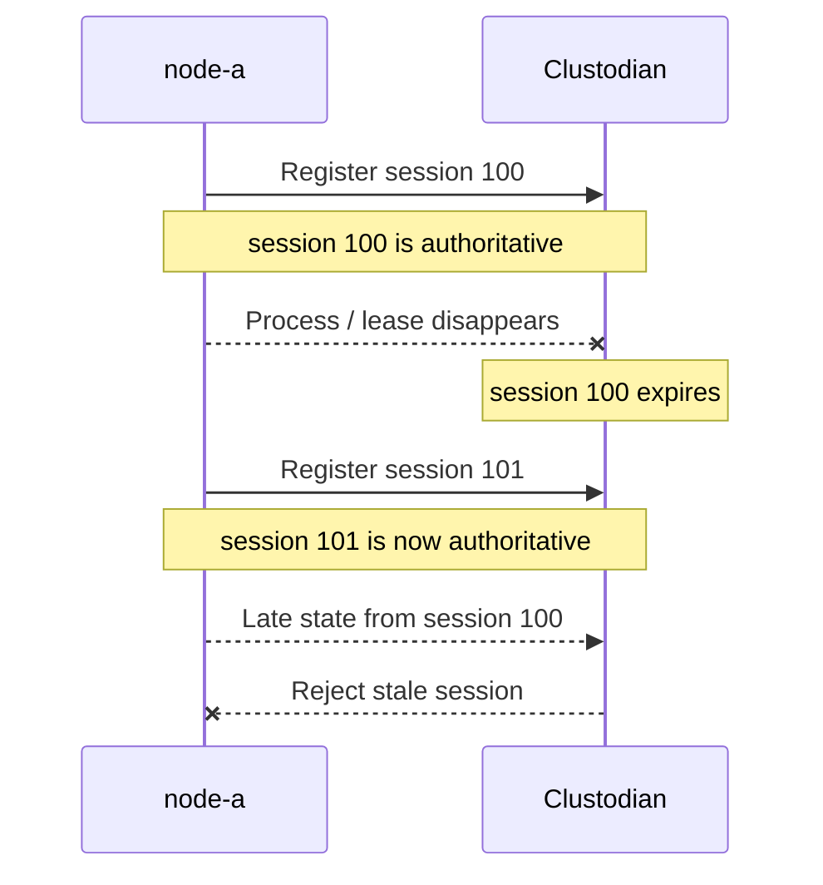
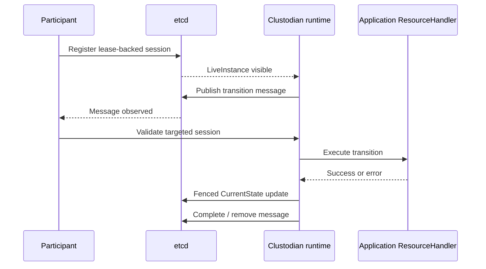
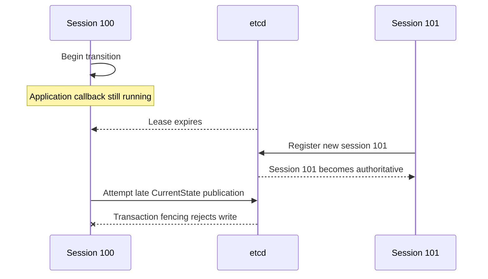
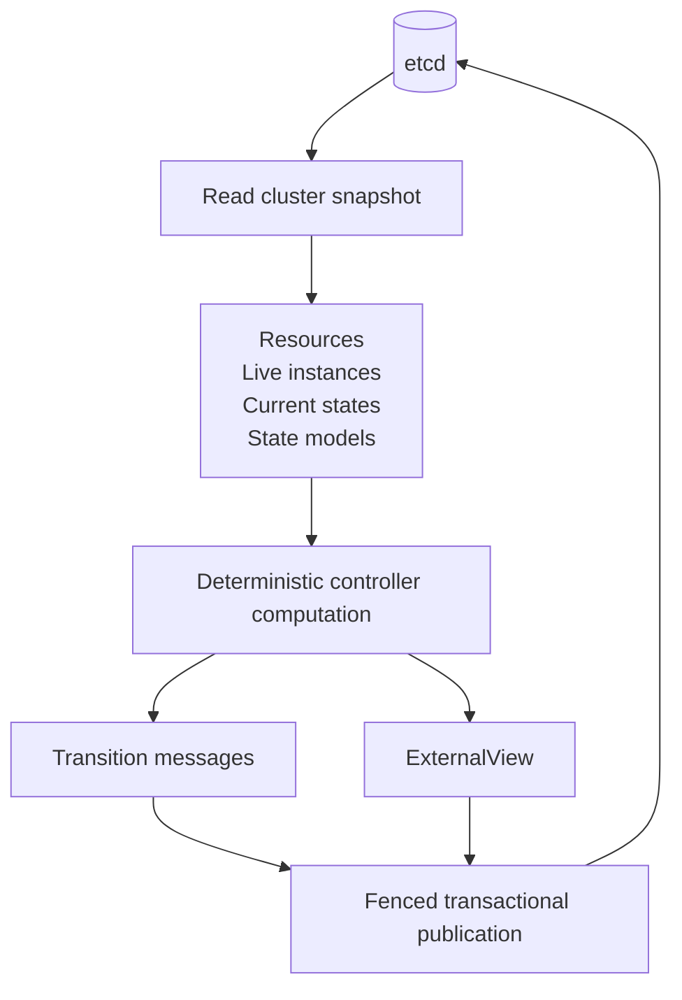
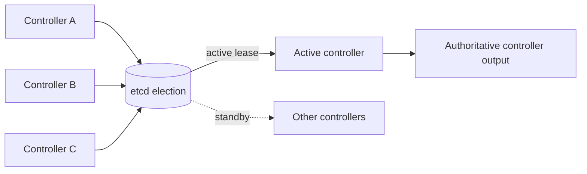
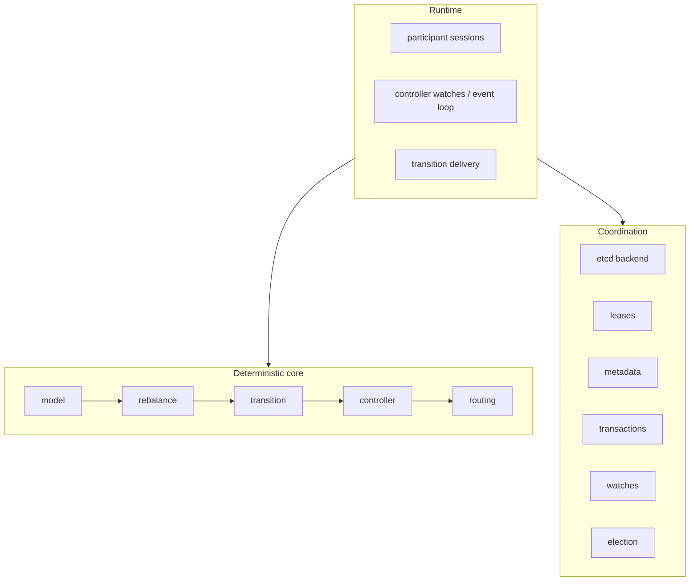
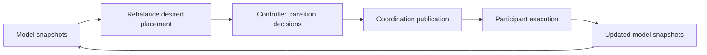
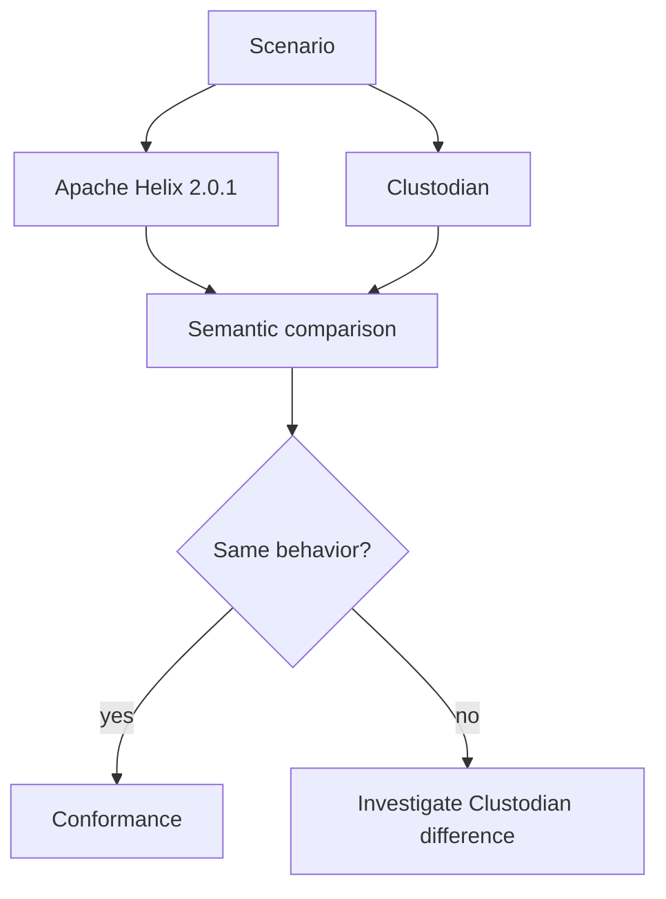
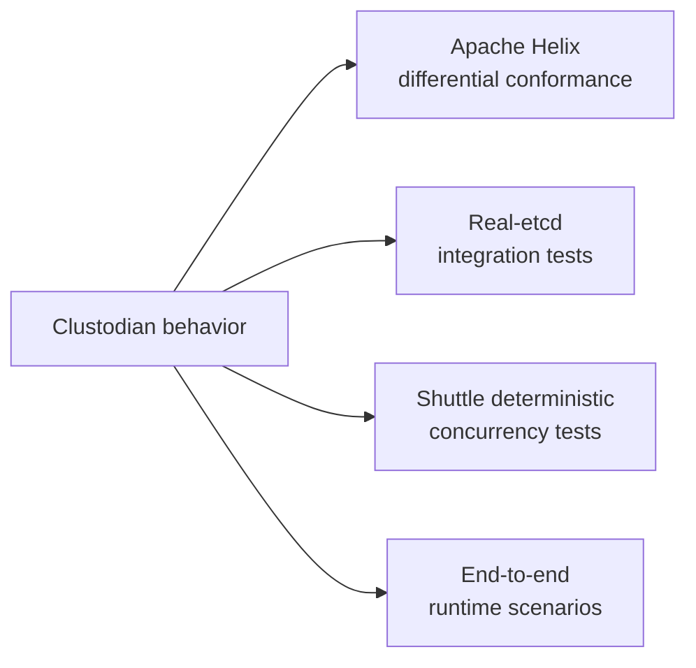

# Clustodian runtime, operations, and verification

This document contains the production-runtime and contributor-facing material split out of the main [README](README.md). The README stays focused on what Clustodian is, when to use it, the deterministic-core/runtime distinction, the public facade, examples, and supported capabilities.

Use this document when you need to understand or operate the distributed runtime: etcd connectivity, sessions, fencing, transition execution, controller failover, internal architecture, Apache Helix compatibility, or the project's verification and development lanes.

## Runtime model at a glance

The deterministic core can be embedded without etcd. The distributed runtime adds participant liveness and session identity, transition delivery, controller watches, convergence, election/failover, and transactional fencing. etcd is the coordination backend for those runtime guarantees; it is not part of the deterministic algorithms themselves.

## Secure etcd connections and runtime signals

Local constructors default to `http://127.0.0.1:2379` with no authentication.
For production, configure HTTPS and authentication explicitly:

```rust,no_run
use clustodian::{Cluster, ClusterConfig, EtcdConnectionOptions};

let etcd = EtcdConnectionOptions::new()
    .with_credentials("clustodian", std::env::var("ETCD_PASSWORD")?)
    .with_ca_certificate(std::fs::read("/etc/clustodian/etcd/ca.pem")?)
    .with_client_identity(
        std::fs::read("/etc/clustodian/etcd/client.pem")?,
        std::fs::read("/etc/clustodian/etcd/client-key.pem")?,
    )
    .with_connect_timeout(std::time::Duration::from_secs(5))
    .with_request_timeout(std::time::Duration::from_secs(10));
let cluster = Cluster::connect(
    ClusterConfig::new("production")
        .etcd_endpoints(["https://etcd-1:2379", "https://etcd-2:2379"])
        .etcd_connection_options(etcd),
)
.await?;
```

`EtcdConnectionOptions` supports ordered endpoint failover, CA trust, mutual
TLS, request/connect timeouts, and HTTP/2 keepalive. Its `Debug` output never
prints passwords or private-key bytes. The same settings can be loaded from
`CLUSTODIAN_ETCD_USERNAME`, `CLUSTODIAN_ETCD_PASSWORD`,
`CLUSTODIAN_ETCD_CA_CERT_FILE`, `CLUSTODIAN_ETCD_CLIENT_CERT_FILE`,
`CLUSTODIAN_ETCD_CLIENT_KEY_FILE`, and
`CLUSTODIAN_ETCD_TLS_DOMAIN_NAME`.

Runtime builders accept `on_event` callbacks. They emit authority acquisition
and loss, lease recovery and re-registration, coordination retries,
publication rejection, fatal errors, and graceful shutdown. Applications can
translate these stable signals into metrics and structured logs without
depending on internal etcd keys.

Readiness means the initial snapshot, queued work, and first output/registration
commit have completed. Liveness means the process is still running and its
lease/watch recovery loop has not returned a fatal error. A lost lease is not
reported as healthy ownership: participants stop starting work, register a new
session, and only then resume processing. Controllers stop publishing as soon
as their authority fence is lost. Observers remain read-only and retry
transient coordination failures; callers should bound observation waits.

---

## Membership and sessions

A distributed control plane must distinguish a stable node identity from a particular running incarnation of that node.

Clustodian models:

| Concept | Meaning |
|---|---|
| `InstanceId` | Stable node identity |
| `SessionId` | One concrete participant incarnation |
| `LiveInstance` | The currently live session for an instance |
| `CurrentState` | Replica state reported by a specific participant session |

For example:



State or messages belonging to session `100` must not silently become authoritative for session `101`.

Native Apache Helix uses ZooKeeper ephemeral nodes and ZooKeeper sessions for these semantics.

Clustodian maps the same class of guarantees onto etcd:

| Helix / ZooKeeper | Clustodian / etcd |
|---|---|
| Persistent ZNode | Persistent KV |
| Session | Lease |
| `LiveInstance` ephemeral node | Lease-backed key |
| Session expiry | Lease expiry |
| Watch | Watch |
| Version / CAS | Revision + transaction compare |
| Controller election | Lease-backed election |

This machinery belongs to the runtime.

Callers using only the deterministic core can provide `LiveInstance`, session, and current-state information themselves.

---

## Participant runtime

The participant runtime composes the session model and etcd coordination with
an application-provided asynchronous `ResourceHandler`. The lower-level
`TransitionHandler` remains available for direct runtime integrations.



The application boundary receives information including:

- resource;
- partition;
- source state;
- target state;
- stable transition/message identity.

The handler performs whatever data-plane work is necessary and returns success or an error.

The application does **not** directly update Clustodian's coordination messages or authoritative `CurrentState`.

Clustodian performs those updates itself.

Handler failures follow Helix's `ERROR` semantics.

A transition to `DROPPED` removes the replica's `CurrentState` record.

### Session fencing

Successful `CurrentState` publication and transition-message completion use
session- and exact queue-revision-fenced etcd transactions: the queue key's
modification revision must still equal the revision captured by the caller.



Work started by an old participant session therefore cannot later publish authoritative state after that participant reconnects under a new session.

This is a **control-plane fencing guarantee**.

It is not an exactly-once guarantee for arbitrary application side effects.

Applications must still design their transition handlers appropriately.

---

## Controller runtime and failover

The controller runtime observes cluster metadata through etcd and repeatedly drives the deterministic Clustodian pipeline.



Controller election allows multiple controller processes to exist while maintaining one active authority for a coordination namespace.



Election records are lease-backed.

Publication is transactionally fenced so that a controller that has lost leadership cannot continue writing authoritative controller output.

The complete runtime supports:

- controller takeover;
- participant restart;
- resource and replica changes;
- transition pauses;
- safety checks;
- convergence after failures.

---

## Architecture

The implementation is intentionally split into narrow responsibilities.



The deterministic core centers on:

```text
clustodian/
└── src/
    ├── model/
    ├── transition/
    ├── rebalance/
    ├── controller/
    └── routing/
```

The overall processing flow is:



The modules have deliberately narrow responsibilities:

- `model` owns validated identifiers, state models, immutable snapshots, and session fencing.
- `rebalance` computes desired placement without performing transitions.
- `controller` compares observed and desired state, selects safe work, and publishes messages.
- `coordination::etcd` persists snapshots and messages and handles revisions, leases, and watch recovery.
- `participant` validates and executes one published message through the application transition handler.
- `routing` reads published external state for callers that need placement.

The main design rule is that each computation receives a snapshot and produces a new value.

Mutable construction belongs inside builders and runtime loops.

Readers see immutable values.

Physical etcd keys, lease identifiers, and CRUSH node indexes remain encapsulated inside their owning modules.

Clustodian intentionally does **not** begin with:

- a generic actor system;
- a generic RPC framework;
- a generic consensus abstraction;
- a generic coordination-backend plugin ecosystem;
- an arbitrary backend compatibility matrix.

etcd is the first real coordination backend.

Reusable abstractions are extracted when concrete implementations demonstrate the need for them.

---

## Compatibility

Clustodian does not claim general Apache Helix compatibility.

Compatibility is established **one behavior at a time**.

The project uses an external Apache Helix 2.0.1 checkout as an executable oracle.

It is intentionally not vendored:

```text
reference/
├── apache-helix-2.0.1/       # ignored external checkout
└── apache-helix/
    ├── oracle/
    ├── scenarios/
    └── verify-m*.sh
```

For supported behavior:



The Java side calls the real Apache Helix implementation.

The Rust side calls Clustodian.

If the two disagree, the Clustodian implementation is assumed to be wrong until the difference is understood.

Runtime features follow the same principle where practical: preserve the relevant Helix participant, session, controller, and failure semantics while implementing their required coordination guarantees using etcd.

### What compatibility means

Clustodian compares semantics rather than Java implementation details.

Semantics that matter include:

- placement;
- replica state;
- next transition;
- state priority;
- transition throttling;
- `ExternalView`;
- routing result;
- participant session identity;
- liveness transitions;
- controller convergence.

Implementation details that generally do not matter include:

- Java class hierarchy;
- ZNRecord binary/layout compatibility;
- `HashMap` ordering;
- message UUID formatting;
- timestamps;
- ZooKeeper paths;
- ZooKeeper API compatibility.

The goal is behavioral compatibility for the supported subset, not source, API, storage, or wire compatibility.

---

## Verification

Clustodian uses several complementary forms of verification.



### Apache Helix differential conformance

Supported deterministic and runtime semantics are compared against a pinned Apache Helix 2.0.1 implementation.

These tests establish that the selected semantics behave the same way for the scenarios under test.

### Real-etcd integration tests

Runtime behavior is exercised against real etcd.

These tests cover the actual mapping of Clustodian semantics onto:

- leases;
- revisions;
- watches;
- transactions;
- elections;
- session fencing.

### Deterministic concurrency testing

Concurrency-sensitive participant, controller, and watch-cursor state transitions have Shuttle coverage.

Shuttle tests use the production transition state machines together with an in-memory model around the same atomic backend boundaries.

They deliberately do not use:

- etcd;
- sockets;
- filesystems;
- wall-clock delays.

Run the focused suite with:

```bash
cargo test -p clustodian --features shuttle --lib shuttle_
```

The default run performs 2,000 PCT iterations at bug depth 3 and also runs selected random schedules.

The bounds can be changed with:

```text
CLUSTODIAN_SHUTTLE_ITERATIONS
CLUSTODIAN_SHUTTLE_PCT_DEPTH
```

For example:

```bash
CLUSTODIAN_SHUTTLE_ITERATIONS=20000 \
CLUSTODIAN_SHUTTLE_PCT_DEPTH=5 \
cargo test -p clustodian --features shuttle --lib shuttle_
```

Shuttle emits a replayable schedule when a run fails.

Replay it with `SHUTTLE_SCHEDULE`:

```bash
SHUTTLE_SCHEDULE='<schedule>' \
cargo test -p clustodian \
  --features shuttle \
  --lib \
  shuttle_tests::shuttle_session_expiry_before_completion_is_fenced \
  -- --exact
```

For seeded random exploration, use:

```text
SHUTTLE_RANDOM_SEED
```

`SHUTTLE_PERSIST_SEED` is also accepted as a compatibility fallback.

The normal Tokio build remains the default when `shuttle` is disabled.

Real-etcd integration tests are run separately and verify that the concurrency and fencing semantics map correctly onto actual etcd behavior.

---

## Development

Clustodian is a standalone Cargo workspace.

### Build and test

From the repository root:

```bash
cargo fmt --all --check

cargo clippy \
  --workspace \
  --all-targets \
  --all-features \
  -- -D warnings

# Runs the normal test suite, including real-etcd integration tests.
cargo test --workspace --all-targets --no-default-features

# Also checks the Shuttle and failpoint-enabled feature set.
cargo test --workspace --all-targets --all-features
```

### Focused coverage

With `cargo-llvm-cov` installed, measure the deterministic library tests and
the real-etcd runtime target separately:

```bash
cargo llvm-cov --lib --no-default-features --summary-only
cargo llvm-cov --test etcd_runtime --no-default-features --summary-only \
  -- --test-threads=1
```

The reports are target-specific rather than additive. The integration command
requires `etcd` on `PATH` or `CLUSTODIAN_ETCD_TEST_ENDPOINT`.

The real-etcd target is intentionally serialized because each locally spawned
server owns a temporary backend. Use `--test-threads=1`, and ensure failed CI
runs clean up child processes and temporary data directories before retrying.
The release gate runs this lane independently from the parallel unit and
feature-matrix lanes.

### etcd for integration tests

Using Clustodian's deterministic core does **not** require etcd.

Some runtime integration tests do.

For the real-etcd test lane, either:

- have `etcd` available on `PATH`; or
- point Clustodian at an already-running endpoint with:

```text
CLUSTODIAN_ETCD_TEST_ENDPOINT
```

Otherwise, the integration fixture starts a temporary local etcd process.

The all-features lane enables Shuttle, so the real-etcd integration target is intentionally excluded from that lane and is covered by the normal Tokio test lane instead.

The minimum supported Rust version is 1.80. CI also checks documentation,
package contents, and the failpoint-enabled real-etcd lane. Randomized stress,
multi-member etcd failover, and crash-matrix coverage are scheduled checks;
they are intentionally kept out of the short pull-request gate.

### Apache Helix oracle

The ordinary Rust build and tests do not require Apache Helix.

Differential Helix conformance testing additionally requires:

- Maven; and
- an Apache Helix 2.0.1 checkout at:

```text
reference/apache-helix-2.0.1/
```

or at the path configured through:

```text
CLUSTODIAN_APACHE_HELIX_SOURCE
```

---
